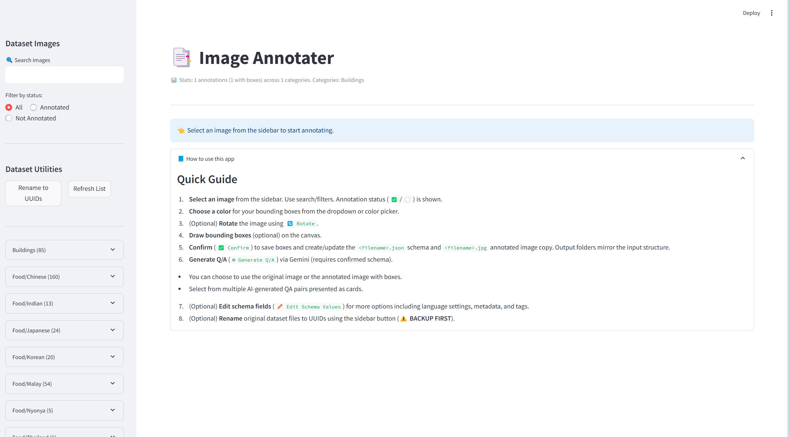

# Image Annotater

Image Annotater is a Streamlit-based application for annotating images with bounding boxes and generating bilingual 
(English & Malay) question-answer pairs using Google's Gemini AI. This tool is designed for creating datasets to train vision-language models.



# Note
Please use light mode in your browser! As dark mode is not supported yet.

## Features

- 📂 **Hierarchical file explorer** for navigating your image dataset
- 🖌️ **Interactive canvas** for drawing, moving, and resizing bounding boxes
- 📊 **Live coordinate readout** for precise annotations
- 🤖 **AI-assisted Q/A generation** with Gemini AI
- 📝 **Schema editor** for customizing metadata and annotations
- 🔄 **Image rotation** for better annotation angles
- 🔍 **Search and filter** capabilities for quick navigation
- 🆔 **Batch renaming** to UUIDs for better tracking
- 🔍 **Image zoom in/out** supported natively so no need to zoom in/out the browser to see the entire 
image without scrolling 

## Installation

### Prerequisites

- Python 3.11+
- Dataset of images to annotate (place under project folder)

### Setup

1. Clone this repository:
   ```bash
   git clone https://github.com/ziflhigan/Image_Annotater.git
   cd image_annotater
   ```

2. Create and activate a virtual environment (recommended) (**Conda env is recommended**):
   ```bash
   python -m venv venv
   # On Windows
   venv\Scripts\activate
   # On macOS/Linux
   source venv/bin/activate
   ```

3. Install dependencies:
   ```bash
   pip install -r requirements.txt
   ```

4. Create a `.env` file in the project root with your Gemini API key:
   ```
   GEMINI_API_KEY="your_api_key"
   GEMINI_MODEL="gemini-2.5-flash-preview-04-17"
   ```
   
   You can obtain a free API key from [Google AI Studio](https://aistudio.google.com/apikey). The free tier includes 1 million tokens per day, which is sufficient for most annotation projects.

5. Prepare your dataset:
   - Create a `dataset` folder in the project root
   - Organize images into subdirectories by category (e.g., `dataset/Food/Japanese/img_001.jpg`)

## Usage

Start the application:
```bash
streamlit run src/main.py
```

### Basic Workflow

1. **Select an image** from the sidebar file explorer
2. **Choose a color** for your bounding boxes using the dropdown or color picker
3. **Draw bounding boxes** on the canvas (optional)
4. Click **✅ Confirm** to save the annotation
5. Click **🤖 Generate Q/A** to create AI-generated question-answer pairs
6. Select a Q/A pair from the generated options
7. Edit the schema if needed using the **Edit Schema Values** expander

## Demo Videos

### 1. Renaming Files to UUIDs

This video demonstrates how to use the "Rename to UUIDs" button in the sidebar to convert all image filenames to unique identifiers for better tracking and organization.

<video width="630" height="300" src="https://github.com/ziflhigan/Image_Annotater/blob/main/assets/rename_demo.mp4" controls></video>

> ⚠️ **IMPORTANT**: Always back up your dataset before using the rename function, as it modifies the original files and cannot be easily undone.

### 2. Drawing Rectangles and Schema Editing

This video shows how to:
- Draw bounding boxes on an image
- Click "Confirm" to generate the default schema
- Edit schema values including languages, difficulty, and metadata

[▶️ Watch Annotation Demo](https://github.com/ziflhigan/Image_Annotater/blob/main/assets/annotation_demo.mp4)

### 3. AI-Generated Question-Answer Pairs

This video demonstrates:
- Clicking the "Generate Q/A" button to use Gemini AI
- Choosing between original image or annotated image with boxes
- Selecting one of the multiple generated Q/A pairs
- Viewing the updated schema

[▶️ Watch Q/A Generation Demo](https://github.com/ziflhigan/Image_Annotater/blob/main/assets/qa_generation_demo.mp4)

## Folder Structure

After you start annotating, the app will automatically create:

- `annotated_dataset/` 
  - `annotated_[category]/` - Images with drawn boxes
  - `schema_[category]/` - JSON annotation files

For example:
```
- dataset/
  - Food/
    - Japanese/
      - img_001.jpg
- annotated_dataset/
  - annotated_Food/
    - Japanese/
      - img_001.jpg
  - schema_Food/
    - Japanese/
      - img_001.json
```

## Advanced Configuration

### Environment Variables

You can customize the application behavior with these environment variables:

- `GEMINI_API_KEY` - Your Gemini API key (required)
- `GEMINI_MODEL` - Gemini model to use (default: "gemini-2.0-flash")
- `DEBUG_ANNOTATER` - Set to "1" for verbose logging (default: "0")
- `DEBUG_GEMINI` - Set to "1" for Gemini API debugging (default: "0")

### Schema Format

The application uses a fixed schema format with these key fields:

- `image_id` - Unique identifier for the image (filename stem or UUID)
- `image_path` - Path to the original image
- `task_type` - One of: "captioning", "vqa", "instruction"
- `text_en` - English question or instruction
- `text_ms` - Malay question or instruction
- `answer_en` - English answer
- `answer_ms` - Malay answer
- `difficulty` - One of: "easy", "medium", "hard"
- `bounding_box` - List of bounding boxes (rectangle coordinates)
- Additional metadata fields

## Troubleshooting

### API Key Issues

- Error: "Missing required env var: GEMINI_API_KEY"
  - Ensure you've created a `.env` file with your API key
  - Check that the API key is valid and active

### Image Loading Problems

- If images fail to load, check:
  - File formats (supported: jpg, jpeg, png, webp, gif, bmp, tiff, heic, heif)
  - Image paths don't contain special characters
  - Install pillow-heif for HEIC/HEIF support: `pip install pillow-heif`

### Gemini API Errors

- "Error processing Gemini response"
  - Verify your internet connection
  - Check API quota limits (Google AI Studio provides 1M tokens/day)
  - Try a different model in your `.env` file

## License

This project is licensed under the MIT License - see the LICENSE file for details.

## Acknowledgments

- Built with [Streamlit](https://streamlit.io/)
- Powered by [Google Gemini AI](https://deepmind.google/technologies/gemini/)
- Uses [streamlit-drawable-canvas](https://github.com/andfanilo/streamlit-drawable-canvas) for annotation capabilities

---

Developed by Fang Zhili / UM - WID3013 CVPR Group "Ctrl+Alt+Vision" - © 2025  
For questions or support, contact: s2189538@siswa.um.edu.my


*Image Annotater is an open-source project created to simplify the process of building high-quality vision-language datasets.*